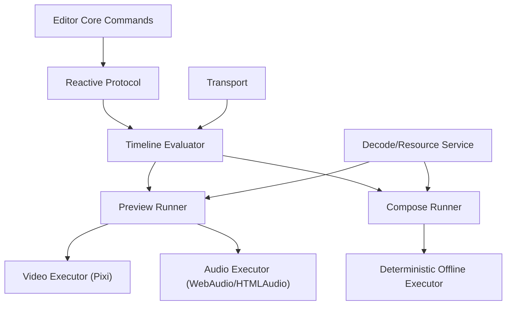

# RFC 0001: Timeline Scheduler Architecture (Preview + Compose)

- Status: Draft
- Owner: Renderer Team
- Created: 2026-02-24
- Target release: v1 incremental rollout

## 1. Summary

Introduce a unified `Timeline Scheduler` architecture for the video editor renderer stack.

Key decisions:

1. `Transport` is the only source of playback time truth.
2. `Timeline Evaluator` is shared by both preview and compose.
3. Preview and compose use different executors, but the same timeline evaluation logic.
4. Decode/resample/format compatibility can use mature libraries (for example `libmedia`), but scheduling and state machines remain in-house.

## 2. Problem Statement

Current behavior has improved, but core orchestration is still spread across rendering and audio execution paths:

1. Playback time advances in render loop delta, then audio sync is driven from rendering cadence.
2. Audio path mixes multiple execution modes (`<audio>`, WebAudio buffer sources, MP4 tick audio) in one manager.
3. Preview and compose do not share a single audio evaluation path.
4. Segment lifecycle and repeated start/stop boundaries are managed locally, not by a unified scheduler state machine.

These conditions increase risk of:

1. Audible artifacts (`pops`, `crackles`, repeated restart, drift).
2. Preview/compose mismatch.
3. Regressions when adding transitions, effects, and multi-track features.

## 3. Goals

1. Stable real-time preview with bounded drift and controlled resync.
2. Deterministic compose output with high consistency against preview.
3. A single time-evaluation model for video, image, audio, effect, and transition.
4. Clear module boundaries: `transport`, `evaluator`, `scheduler`, `executors`, `decode`.
5. Incremental migration without breaking existing public API.

## 4. Non-goals (v1)

1. Rebuild the protocol schema in one step.
2. Add all advanced DSP/effect engines in v1.
3. Replace all decode backends immediately.
4. Introduce cross-process sync or distributed rendering.

## 5. Constraints

1. Keep `createRenderer()` API stable for current playground and consumers.
2. Keep `composeProtocol()` API stable.
3. Continue protocol-driven behavior from `@video-editor/editor-core` commands.
4. Preserve strict TypeScript and current package boundaries.

## 6. Proposed Architecture



### 6.1 Layer responsibilities

1. `Transport`
   - Owns play/pause/seek/rate/time anchors.
   - Converts wall clock to timeline time.
2. `Timeline Evaluator`
   - Pure evaluation from `(protocol, time/window)` to plans.
   - No direct IO, no playback side effects.
3. `Runner`
   - Drives scheduling loop.
   - Calls evaluator and dispatches to executors.
4. `Executor`
   - Performs actual rendering/audio playback/composition.
   - No ownership of business timeline decisions.
5. `Decode/Resource Service`
   - Fetch/decode/cache/media metadata.
   - Pluggable implementation (`native`, `mediabunny`, `libmedia`, hybrid).

## 7. Data Model (v1)

```ts
export interface TransportSnapshot {
  playing: boolean
  timelineMs: number
  rate: number
  epochWallMs: number
  epochTimelineMs: number
}

export interface EvalContext {
  atMs: number
  windowStartMs: number
  windowEndMs: number
  fps: number
}

export interface VisualPlanItem {
  segmentId: string
  trackId: string
  zOrder: number
  sourceTimeMs: number
  opacity: number
  transform?: unknown
  effects?: unknown[]
}

export type AudioVoiceAction = 'start' | 'stop' | 'seek' | 'gain' | 'rate'

export interface AudioPlanEvent {
  segmentId: string
  action: AudioVoiceAction
  atTimelineMs: number
  sourceTimeMs?: number
  gain?: number
  rate?: number
}

export interface TimelinePlan {
  atMs: number
  visuals: VisualPlanItem[]
  audioEvents: AudioPlanEvent[]
}
```

## 8. Scheduling Model

### 8.1 Transport

1. `play()` sets anchor using current wall clock and timeline value.
2. `pause()` freezes timeline value.
3. `seek(ms)` updates timeline immediately and marks discontinuity.
4. `setRate(rate)` updates anchor and rate atomically.

Timeline conversion:

```txt
timelineMs = epochTimelineMs + (nowWallMs - epochWallMs) * rate
```

### 8.2 Preview Runner

1. Video render cadence: `requestAnimationFrame`.
2. Audio schedule cadence: fixed interval ticker (for example `20ms`).
3. Audio lookahead window: `100ms` default.
4. No per-frame seek. Seek only on:
   - playhead discontinuity,
   - drift > threshold,
   - explicit user seek.
5. Drift target:
   - soft threshold: `80ms`,
   - hard threshold: `200ms` (force resync).

### 8.3 Voice state machine

Each audio segment voice follows:

```txt
idle -> primed -> playing -> ended -> disposed
```

Rules:

1. `start` only allowed from `idle/primed`.
2. `seek` on active voice transitions to `primed` then `playing`.
3. `stop` is idempotent.
4. Executor must reject duplicate `start` for same `(segmentId, generation)`.

## 9. Time Evaluation Rules

### 9.1 Base segment mapping

For time-remappable segments (`audio`, `video`):

```txt
segmentRelativeMs = timelineMs - segment.startTime
sourceMs = fromTime + segmentRelativeMs * playRate
```

Where:

1. `fromTime` default is `0`.
2. `playRate` default is `1`.
3. clamp to media duration and segment bounds.

### 9.2 Fade and gain

1. Evaluate envelope in evaluator:
   - fade in,
   - fade out,
   - base volume.
2. Executor receives final gain event; executor does not infer business envelope.

### 9.3 Transition modeling

1. Treat transition as boundary behavior between adjacent frame segments.
2. Evaluator emits blend parameters during overlap window:
   - `fromSegment`,
   - `toSegment`,
   - `progress 0..1`,
   - transition type params.

### 9.4 Effect/filter modeling

1. Effects and filters become time functions:
   - `param = f(timelineMs)`.
2. Evaluator resolves active effect/filter stacks.
3. Executor only applies resolved parameters.

## 10. Module Plan (new files)

Planned renderer modules:

1. `packages/renderer/src/timeline/transport.ts`
2. `packages/renderer/src/timeline/evaluator.ts`
3. `packages/renderer/src/timeline/types.ts`
4. `packages/renderer/src/timeline/preview-runner.ts`
5. `packages/renderer/src/timeline/compose-runner.ts`
6. `packages/renderer/src/executors/audio-preview-executor.ts`
7. `packages/renderer/src/executors/video-preview-executor.ts`
8. `packages/renderer/src/media/decode-service.ts`

## 11. Integration with Current Code

1. `packages/renderer/src/renderer-core.ts`
   - Keep public API.
   - Replace direct time accumulation ownership with transport snapshot access.
   - Call preview runner instead of ad-hoc audio sync in render path.
2. `packages/renderer/src/audio-manager.ts`
   - Gradually reduce to audio preview executor responsibilities.
   - Remove mixed ownership of scheduling policy.
3. `packages/renderer/src/compose.ts`
   - Use compose runner with shared evaluator.
4. `packages/renderer/src/protocol-clip.ts`
   - Reuse evaluator time mapping to reduce preview/compose divergence.

## 12. Decode Strategy (`libmedia` compatibility)

`libmedia` (or equivalent) can be introduced behind `DecodeService`:

1. Scope for mature library:
   - decode pipeline,
   - format compatibility,
   - optional resample quality.
2. Scope not delegated:
   - timeline decisions,
   - voice lifecycle state machine,
   - scheduling and resync policy.

This keeps scheduler deterministic and backend-agnostic.

## 13. Migration Plan

### Phase 0: RFC + baseline metrics

1. Add this RFC.
2. Record baseline preview behavior:
   - drift distribution,
   - audible artifacts reports,
   - seek recovery latency.

### Phase 1: Transport + evaluator (no behavior change target)

1. Implement transport and evaluator.
2. Adapter layer returns plans while current executors still run.
3. Add unit tests for evaluator outputs.

### Phase 2: Audio scheduling migration

1. Introduce preview runner audio ticker + lookahead.
2. Move start/stop/seek decisions to scheduler.
3. Remove fallback scheduling branches after parity verification.

### Phase 3: Video/effect/transition migration

1. Use evaluator output for visual stack and transition params.
2. Remove duplicate timing decisions in video update code.

### Phase 4: Compose unification

1. Compose runner consumes the same evaluator.
2. Add consistency tests between preview key moments and compose frames/audio.

### Phase 5: Legacy cleanup

1. Remove deprecated scheduling branches.
2. Keep decode backends pluggable.

## 14. Testing Strategy

### 14.1 Unit tests

1. `transport`: play/pause/seek/rate math.
2. `evaluator`: segment activation, source mapping, fade envelope, transition window.
3. `voice state`: duplicate start protection, seek resync behavior.

### 14.2 Integration tests

1. Preview:
   - repeated seek,
   - pause/resume,
   - large jump,
   - long playback.
2. Compose:
   - deterministic output checks at fixed timestamps.

### 14.3 Regression tests

1. Reuse existing renderer tests and add scheduler-focused cases.
2. Add tests covering protocol deep mutations and track reorder side effects.

## 15. Acceptance Criteria (v1)

1. Continuous 10-minute preview playback without repeated voice restarts.
2. Seek recovery to stable A/V sync within 300ms.
3. No per-frame audio seek during steady playback.
4. Preview/compose key timestamp alignment within agreed threshold:
   - video <= 1 frame,
   - audio <= 40ms for v1.

## 15.1 Confirmed Defaults (2026-02-24)

1. Drift strategy uses two thresholds together:
   - soft threshold: `70ms`
   - hard threshold: `200ms`
2. User-initiated drag/seek always triggers hard resync path.
3. Audio preview engine defaults to `WebAudio-first`.
4. Compose/mix sample-rate policy:
   - internal mix bus: fixed `48kHz`, `32-bit float`
   - default export: `48kHz`
   - optional export preset: `44.1kHz`

## 16. Risks and Mitigations

1. Risk: migration complexity across hot files.
   - Mitigation: phased rollout + package-level regression tests.
2. Risk: backend decode differences.
   - Mitigation: keep evaluator deterministic and backend-independent.
3. Risk: transition/effect protocol gaps.
   - Mitigation: evaluator extension points and protocol-compatible defaults.

## 17. Open Questions

1. None in v1.
   - transition data model is unified to explicit `protocol.transitions` edges.

## 18. Out of Scope Follow-up RFCs

1. Protocol v2 transition/effect curve schema.
2. GPU effect graph and color pipeline.
3. Multi-device/network collaborative transport sync.
