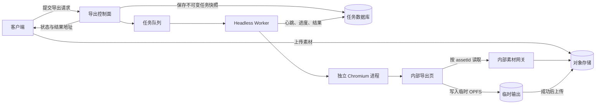

# RFC 0008：基于 Headless Chromium 的服务端导出

- 状态：草案
- 创建日期：2026-09-03
- 范围：服务端离线合成、任务边界、素材交付与运行隔离
- 相关文档：[RFC 0005](./0005-stable-asset-identity.md)、
  [RFC 0006](./0006-media-asset-public-api.md)、[RFC 0007](./0007-unified-media-io.md)

## 1. 摘要

第一版服务端导出使用由服务端控制的 Headless Chromium 运行现有浏览器合成器。Worker 启动独立
Chromium 进程，打开不含编辑器界面的内部导出页，在页面中调用 `createExportTask()`；该 API
内部调用 `composeProtocol()`，完成 PixiJS 渲染、媒体解码、音频混合、WebCodecs 编码与容器
封装。

该方案的目标是把导出从用户设备迁移到可控环境，同时最大限度复用现有渲染结果。第一版不把
合成器改写为原生 Node.js 或 FFmpeg 实现。本文只形成架构决策，不包含服务代码；外部 HTTP 字段、
队列产品、云厂商和部署平台也不在本 RFC 中确定。

## 2. 背景与问题

当前离线合成在用户浏览器中执行。`createExportTask()` 已在任务创建时冻结协议，并提供进度、取消、
重试、流式 sink 和明确的完成状态；`composeProtocol()` 也按固定媒体时间逐帧渲染，不依赖
`requestAnimationFrame`。这些能力适合继续作为服务端导出的合成内核。

问题在于，用户浏览器不是可靠的长任务运行环境。关闭或刷新页面、操作系统回收后台标签页、设备
进入休眠、磁盘空间不足，以及用户设备的 CPU、GPU、浏览器和编码器差异，都可能中断导出或改变
性能。用户与页面断开连接后，任务也缺少独立的生命周期和结果交付方式。

另一方面，现有合成器不是普通 Node.js 程序。它依赖以下浏览器能力：

- PixiJS Canvas 和 WebGL 渲染。
- WebCodecs 视频解码与编码。
- `OfflineAudioContext` 和 `AudioBuffer` 音频混合。
- DOM、浏览器字体、SVG `foreignObject`、`ImageBitmap` 和 `OffscreenCanvas` 文本栅格化。
- OPFS 素材缓存和临时文件。

因此，服务端导出的第一步是把浏览器运行时放到服务端，而不是替换渲染引擎。

## 3. 决策

1. 第一版服务端导出使用固定版本的 Headless Chromium，并通过 Playwright 管理进程和页面。
2. 每个导出尝试使用独立的 Chromium 进程和临时浏览器目录。一个 Worker 同时只执行一个任务；
   提高并发时增加 Worker 数量，不在同一浏览器进程内并行多个任务。
3. Chromium 只打开内部导出页。导出页不加载 Vue 编辑器界面，只加载协议校验、renderer、media
   和必要的运行时资源。
4. 导出输入是不可变的任务快照，包含协议、素材清单、完整输出参数和固定的运行时版本。
5. 客户端 OPFS 不属于服务端输入。任务进入队列前，所需素材必须已经上传到服务端可读的持久化
   存储。
6. 第一版先把输出写入服务端 Chromium 自己的临时 OPFS 文件，成功后再上传并发布。不得通过
   `page.evaluate()` 或类似的进程通信接口传递完整视频 `Blob`。
7. 服务端导出采用严格失败策略。素材、字体、解码、逐帧渲染或输出校验失败时，任务失败；不得用
   占位图、静止帧或无声文件报告成功。
8. 原生 Node.js 或 FFmpeg 合成器属于另一套渲染后端，需要单独的 RFC 和一致性验证。

## 4. Headless Chromium 能解决什么

Headless Chromium 仍然是浏览器运行时。它改变的是浏览器的所有权和运行环境，不会自动修复合成器
内部的正确性、资源和性能问题。

| 问题 | 结论 | 负责机制 |
| --- | --- | --- |
| 用户关闭、刷新或离开页面 | 不再影响已接受的任务。 | 服务端 Chromium 与用户页面分离。 |
| 客户端后台节流、休眠和电量策略 | 不再直接影响合成。服务端仍可能受到 CPU 配额、挂起、内存不足（OOM）或 GPU 上下文丢失影响。 | Worker 隔离、资源限额与恢复。 |
| 用户设备性能、浏览器版本和可用编码器不同 | 大幅收敛。服务端固定镜像和运行参数，但升级后仍需重新验收。 | 固定运行时与回归测试。 |
| 客户端网络短暂断开 | 任务继续运行，客户端可以重新查询。 | 控制面、队列和任务数据库。 |
| 客户端 OPFS 中的素材不可访问 | 仍然存在。必须先上传素材，再提交任务。 | 素材交付协议。 |
| 浏览器 API、WebGL、字体和 WebCodecs 依赖 | 仍然存在，但由服务端镜像统一提供和检查。 | 运行时镜像与能力预检。 |
| 视觉素材失败后显示占位图或旧帧 | 仍然存在。 | renderer 严格导出模式。 |
| 长片音频和完整媒体 `Blob` 的内存占用 | 仍然存在。 | 资源限额、单任务 Worker 和后续流式优化。 |
| 输出流对慢速远端 sink 的背压不足 | 仍然存在。 | 第一版先写快速本地临时文件。 |
| Chromium 崩溃、超时和任务重试 | 仍然存在。 | Worker、租约和任务状态。 |
| 任意 URL 引入的服务端请求伪造（SSRF）风险 | 成为服务端安全问题。 | 严格素材网关与网络隔离。 |

## 5. 目标与非目标

### 5.1 目标

- 导出不受用户页面和用户设备生命周期影响。
- 服务端与客户端尽量复用同一协议、时间轴求值、PixiJS 渲染和媒体编码实现。
- 同一任务使用固定的协议、素材版本、字体和输出参数，不读取导出开始后的工程修改。
- 素材缺失、能力不支持和渲染错误在昂贵工作开始前尽早失败。
- 任务支持持久化状态、取消、全量重试、进度查询和结果校验。
- 不把完整输入或输出文件保存在 Node.js 堆内存中。
- 为后续容量规划保留分阶段耗时、资源用量和失败原因。

### 5.2 非目标

- 第一版不实现原生 Node.js、FFmpeg 或 GPU 原生渲染器。
- 不提供服务端实时预览、协同播放或交互式编辑。
- 不复用或同步用户浏览器的 OPFS。
- 不允许协议直接引用任意公网或内网 URL。
- 不保证不同 Chromium、操作系统或编码器之间产生字节完全一致的 MP4。
- 不支持任务运行期间合入新的工程编辑。
- 不支持分布式逐帧渲染、断点续算或从中间帧恢复。
- 本 RFC 规定任务、素材和尝试必须绑定同一租户身份，但不规定外部 HTTP 字段、鉴权技术、计费、
  云厂商和部署平台。

## 6. 可行性与当前约束

2026-09-03 的本地冒烟验证已确认以下路径可以在 Playwright 启动的 Headless Chrome 143 中运行：

- PixiJS 文本渲染到 Canvas，再通过 WebCodecs 生成 AVC MP4。
- 读取 HTTP 视频、逐帧解码、经 PixiJS 合成，再生成 AVC MP4。

该验证说明技术路径可行，但不等于生产验收。目标 Linux 镜像、字体包、WebGL 后端、长片、并发、
异常素材和进程恢复仍需单独测试。

现有代码还存在以下需要在服务化前处理的边界：

- `createExportTask()` 的 `start()` 在失败时返回状态，不会把任务错误直接抛给 Worker。导出页必须
  检查最终 `state.status === 'success'`。
- `retry()` 会复用创建任务时传入的 sink。服务端每次尝试必须创建新的任务、临时文件和 sink。
- `resolveProtocolAssetUrls()` 在 resolver 返回 `undefined` 时保留协议中的旧 URL。服务端 resolver
  必须对未知素材抛错，不能回退到客户端地址。
- `composeProtocol()` 当前先统一解析一次素材地址，没有分别保留画面和音频解析上下文。一个任务中
  同一 `assetId` 应解析为同一个服务器地址，除非后续修改该 API。
- 音频加载或解码抛错时已经采用严格失败策略，但 `canDecodeAudio() === false` 仍会跳过输入。显式
  音频片段必须在严格模式中失败；没有音轨的视频片段可以继续导出画面。
- 图片、视频加载和视频帧更新仍可能记录日志后继续，并用占位图、冻结帧或 `<video>` 路径继续
  导出。
- 当前编码器把封装数据放入 `ReadableStream` 时不会等待下游远端上传速度。慢速上传可能积累内存。
- `composeProtocol()` 使用 FPS 生成帧时间，但当前没有把 FPS 作为编码器的 `frameRate` 提示，
  也没有暴露关键帧间隔、延迟模式、硬件加速策略和最终编码器配置回调。服务端接入前必须把这些
  参数加入 `ComposeProtocolOptions`，传给编码器并纳入能力检查与结果记录。

## 7. 总体架构



各组件职责如下：

| 组件 | 职责 |
| --- | --- |
| 客户端 | 上传素材、提交导出请求、保存任务 ID、查询状态和取消任务。 |
| 导出控制面 | 鉴权、校验、幂等处理、冻结任务快照、创建任务和返回结果。 |
| 任务队列与数据库 | 保存任务状态、尝试次数、租约、心跳、取消请求和结果元数据。 |
| Headless Worker | 领取任务、准备临时目录、启动和终止 Chromium、上报状态并清理资源。 |
| 内部导出页 | 能力检查、加载字体和素材、调用合成 API、写入临时输出并报告结构化结果。 |
| 内部素材网关 | 只按任务清单中的 `assetId` 提供不可变内容，不接受任意目标 URL。 |
| 对象存储 | 保存已上传素材和最终导出文件；只有成功并通过校验的文件可对外发布。 |

## 8. 不可变任务快照

控制面在任务入队前生成内部任务快照。以下 TypeScript 只描述数据边界，不承诺外部 API 的具体字段：

```ts
interface ExportJobSpecV1 {
  schemaVersion: 1
  tenantId: string
  jobId: string
  protocol: IVideoProtocol
  assets: Array<{
    assetId: string
    revision: number
    variant: 'original' | 'editing-proxy'
    objectKey: string
    sha256: string
    sizeBytes: number
    contentType: string
    sourceAssetId?: string
    sourceRevision?: number
    proxyProfile?: string
  }>
  output: {
    width: number
    height: number
    fps: number
    format: 'mp4'
    videoCodec: 'avc'
    videoBitrate: number
    keyFrameIntervalMs: number
    latencyMode: 'quality'
    hardwareAccelerationHint: 'prefer-hardware' | 'prefer-software'
    includeAudio: boolean
    audioBitrate?: number
  }
  runtime: {
    rendererBuildId: string
    chromiumImageId: string
    fontPackId: string
  }
}
```

快照遵循以下规则：

1. `protocol` 通过协议校验后再保存。Worker 不读取可变的在线工程记录。
2. 宽、高、FPS、格式、编码器、码率、关键帧间隔、延迟模式和硬件加速提示全部写成确定值，不在
   Worker 中重新应用默认值。FPS 必须来自明确的导出设置或协议，不能由浏览器猜测。包含音频时，
   `audioBitrate` 也必须是确定值。生产任务不允许使用 `no-preference`。
3. `runtime` 由服务端选择并记录，客户端不能指定任意 renderer 或 Chromium 构建。
4. 同一次任务的所有重试使用同一份快照。部署新版本后，不自动把旧任务切换到新 renderer。
5. 控制面根据规范化后的快照计算请求摘要。相同幂等键和相同摘要返回同一任务；相同幂等键配合
   不同摘要时明确拒绝。
6. 第一版稳定输出只支持 MP4、AVC 和 AAC。其他已有组合只有通过目标镜像的能力与回归测试后，
   才能在后续任务 schema 版本中开放。
7. 快照引用的 renderer 构建、Chromium 镜像和字体包必须不可变，并至少保留到任务及其重试保留期
   结束。运行时因安全问题提前停用时，旧任务以 `RUNTIME_RETIRED` 失败，不能换用新版本静默重试；
   调用方需要基于当前运行时显式创建新任务。
8. `editing-proxy` 条目必须同时记录 `sourceAssetId`、`sourceRevision` 和 `proxyProfile`；
   `original` 条目不使用这三个字段。

## 9. 素材交付与解析

### 9.1 提交前条件

任务只有在全部外部素材完成上传后才能入队。每个媒体片段必须带有 `assetId`，且任务清单中存在
匹配的 revision、对象键、大小和 SHA-256。旧协议中只有 URL、没有 `assetId` 的素材不能直接进行
服务端导出，需要先导入素材库并生成稳定标识。

`local-asset://`、`blob:`、`file:` 和协议自带的任意 `http(s)` URL 都不能成为 Worker 的最终输入。
导出页使用严格 resolver 把 `assetId` 改写为同源内部地址。resolver 找不到素材、revision 不匹配或
内容哈希校验失败时，任务在渲染前失败。

素材上传入口在首次接收字节时计算哈希，并写入禁止覆盖的内容寻址对象。Worker 第一次读取素材时，
在写入当前任务的 OPFS 缓存过程中同时校验大小和哈希，不重复下载。内部素材网关按清单中的对象键
读取存储，不跟随外部重定向，也不代替调用方请求任意 URL。

### 9.2 原始素材与编辑优化版

素材选择沿用 RFC 0006：存在与当前 source revision 和 profile 一致的编辑优化版时优先选择
`editing-proxy`，否则选择 `original`。控制面在生成任务快照前完成选择，并把最终 variant、对象键
和哈希写入快照。Worker 不得再次选择素材，也不得在已选素材失效后改用另一个版本。

调用方如果需要强制使用原始素材，必须显式选择 `original`。这一选择同样在入队前完成，任务运行
期间不再改变。

### 9.3 OPFS 的边界

客户端 OPFS 与服务端 Chromium 的 OPFS 是两个独立存储空间。服务端 OPFS 只用作单次尝试的高速
临时缓存和输出文件，不作为素材真源，也不跨任务复用。每次尝试使用独立浏览器目录；目录保留到
结果发布成功、尝试确定失败或尝试保留期结束，随后清理。素材和结果的持久化版本以对象存储为准。

## 10. Worker 与内部导出页

### 10.1 启动与预检

Worker 领取任务后按以下顺序执行：

1. 取得任务租约并创建独立临时目录。
2. 验证任务快照、素材清单、资源限额和取消状态。
3. 以非特权用户启动启用沙箱的固定 Chromium 镜像，不使用 `--no-sandbox`。
4. 打开 `localhost` 或内部 HTTPS 安全来源上的导出页。
5. 检查 WebGL、WebCodecs 视频与音频编码、`OfflineAudioContext`、OPFS 和字体包。
6. 对协议中的片段类型、媒体格式、字体、蒙版、色键、特效 ID、滤镜 ID 和转场 ID 执行能力矩阵
   检查。3D、动态图贴或其他尚未纳入服务端支持矩阵的能力必须明确失败。
7. 完成素材可读性、哈希与解码能力预检后，再开始完整音频混合和逐帧渲染。

能力不满足时必须在主要工作开始前失败，不使用 `MediaRecorder`、缺失字体替代或不同的编码器进行
静默降级。

### 10.2 合成

导出页为每次尝试创建新的 `createExportTask()`：

- 传入任务快照中的协议和完整输出参数。
- 使用只接受任务素材清单的 resolver。
- 使用新的临时 OPFS sink，不在内存中收集结果 `Blob`。
- 使用固定帧计划，由 `frameIndex * 1000 / fps` 驱动 `renderAt()`。
- 等待 `createExportTask().start()`；该 API 内部同时等待输出流消费和合成完成。
- `start()` 返回最终状态后检查 `state.status`；只有 `success` 可以进入输出发布阶段。

Worker 进度至少区分 `preflight`、`audio`、`render-and-encode`、`finalize`、`upload` 和
`verify`。当前合成回调只在音频完成后按帧报告数值进度，因此结构化阶段进度需要由导出页包装层
提供，或在后续扩展合成回调。现有 `ComposePerformance` 的 `setupMs`、`audioMs`、`renderMs`、
`captureMs`、`encodeWaitMs`、`finalizeMs` 和 `totalMs` 是累计指标，不是独立进度阶段；这些
指标原样记录，便于比较客户端与服务端性能。

### 10.3 严格导出模式

可信的服务端导出需要为 renderer 增加严格模式，并满足以下行为：

- 未解析素材、图片加载失败、视频加载失败、帧解码失败和纹理更新失败会终止任务。
- 服务端离线合成只使用逐帧解码器。解码器不支持输入时先转码或拒绝任务，不回退
  `HTMLVideoElement`。
- 任何必需字体在首帧前完成加载并校验；缺失字体不使用系统字体替代。
- 能力矩阵不认识的片段类型、媒体格式、蒙版、色键、特效、滤镜或转场会终止任务，不能忽略后
  继续合成。
- 显式音频片段无法解码音频时会终止任务；视频素材本身没有音轨时仍可导出画面。
- resolver、图片和视频读取都接受取消信号和独立超时，进程级截止时间负责终止无法协作取消的
  浏览器操作。
- 错误通过类型化结果返回给 Worker，不依赖抓取 `console.error` 判断成功或失败。

严格模式的具体 API 名称在实现阶段确定，但以上失败语义是服务端发布前置条件。

## 11. 输出、发布与校验

第一版输出流程如下：

1. 编码数据写入当前尝试的临时 OPFS 文件。
2. 合成成功后，导出页把临时文件流式上传到内部输出入口。
3. 输出入口写入不可见的暂存对象，并计算大小和 SHA-256。
4. 校验容器可读取、尺寸正确、时长和轨道符合任务预期。
5. 校验通过后，以条件更新把当前尝试的对象登记为唯一结果，并把任务标记为 `success`。条件更新
   同时检查当前递增隔离令牌（fencing token）、任务仍是 `running`，且取消请求尚未被接受。只有
   任务数据库选中的对象可以对外读取。
6. 合成失败或不可重试的上传、校验失败会删除临时文件和暂存对象，不返回可下载地址。可重试的
   上传故障按第 12 节保留当前尝试的临时文件。

每个暂存对象带有 `attemptId`。任务数据库通过当前租约的隔离令牌执行条件
更新：失去租约的旧 Worker 即使稍后完成，也不能覆盖新尝试的结果。对象存储和任务数据库不能组成
同一个事务，因此后台清理任务需要删除未被数据库选中的暂存对象和过期浏览器目录。

选择临时 OPFS 是因为当前编码器的内部流桥接不会等待慢速远端 sink。直接上传需要先补齐端到端
背压，否则网络慢于编码时可能持续占用内存。临时磁盘写入和后续上传需要分别计时。

不得把数百 MB 的输出通过 Playwright binding、`page.evaluate()` 返回值或单个 Node.js `Buffer`
传出浏览器进程。

## 12. 任务状态、取消与重试

服务端任务使用以下持久化状态：

```text
queued -> running -> success
                  -> failed
                  -> cancelled
```

- Worker 通过租约领取任务并定期写入心跳。租约过期后，调度器可以把基础设施失败的任务交给新
  Worker 重试。
- 每次领取生成新的 `attemptId` 和递增隔离令牌。进度、暂存对象和结果发布都携带这两个值；
  数据库只接受仍持有当前 token 的写入。
- 取消通过条件更新把可运行任务改为 `cancelled`。取消状态先提交时，后续发布必须失败；结果先以
  `success` 提交时，后续取消不再改变结果。Worker 通过 `AbortController` 停止合成；超过宽限
  时间后直接终止 Chromium 进程。
- 整个任务受外层截止时间约束。现有 12 秒超时只覆盖合成音频的获取与解码，resolver 和视觉素材
  读取还需要补充可取消的独立超时；进程级截止时间是最终终止手段。
- 合成失败后的重试从第 0 帧开始，并创建新的 Chromium 进程、浏览器目录、`createExportTask()`、
  sink 和临时输出。第一版不保留中间帧。
- 合成已经成功、但上传或发布遇到暂时故障时，只要同一尝试仍持有租约，Worker 就可以复用已完成的
  临时文件并只重试发布。租约丢失后，新尝试不得读取旧浏览器目录；除非文件已经进入可验证的持久化
  暂存对象，否则必须重新执行完整合成。
- Chromium 崩溃、Worker 退出和临时存储故障可以自动重试。协议无效、素材缺失、能力不支持和可
  重现的渲染错误不自动重试。
- 最大尝试次数属于部署策略，需要在容量测试后确定。无论次数如何，已经发布成功的任务不得重复
  生成结果。

## 13. 确定性与版本锁定

服务端可重复性分为两类：帧数、时间戳、尺寸、轨道和媒体参数属于精确不变量；画面像素、解码后
音频和音视频同步在基线确定的容差内等价。编码器产生的 MP4 字节不要求完全相同。

每个任务记录并固定以下信息：

- renderer 构建 ID、协议 schema 版本和 Mediabunny 版本。
- Chromium 与操作系统镜像 ID。
- 字体包 ID、locale、timezone 和 `devicePixelRatio`。
- PixiJS 分辨率和 WebGL 后端。
- 输出宽高、FPS、容器、视频编码、视频码率、音频码率和关键帧策略。
- 素材 ID、revision、variant、大小和内容哈希。
- 浏览器实际接受的编码器配置和能力检查结果。

Chromium、字体、GPU 驱动或 renderer 升级前，需要用固定样例重新执行画面、音频和性能回归测试。
运行时 ID 固定请求的硬件加速提示和同构 Worker 硬件组；重试必须回到兼容的硬件组。WebCodecs
不会报告实际使用的编码器实现，因此本 RFC 不声称固定了实际后端，仍需通过输出回归测试确认一致性。

## 14. 资源与并发

当前音频路径一次创建完整时长的 48 kHz、双声道、32 位浮点混音缓冲。以本次 12:52.763 的工程
为例，最终混音缓冲本身约占 283 MiB，尚未包含源音频缓冲、完整媒体 `Blob`、视频帧、PixiJS
纹理、编码器队列、Chromium 和临时输出。

第一版因此采用以下原则：

- 一个 Worker 同时运行一个导出任务，并设置进程内存和临时磁盘上限。
- 在入队前限制时长、分辨率、FPS、总帧数、素材数量、素材总大小和单个素材大小。
- 根据各音频片段的时长、声道和采样率估算解码后 PCM 峰值，限制并行音频解码数；预计超过 Worker
  内存预算的任务在入队前失败。压缩素材大小不能替代这项检查。
- 超出限制时在启动 Chromium 前返回明确错误。
- Worker 在每次任务后退出 Chromium；未来只有在内存稳定性得到证明后才考虑复用进程。
- 记录峰值内存、临时磁盘、素材下载、音频、逐帧渲染、编码等待、sink 写入和上传耗时。当前任务
  指标不包含 sink 写入耗时，实现时需要在 OPFS sink 外层增加字节数和耗时统计。

具体限额和并发数必须根据目标机器上的长片基准测试确定，本 RFC 不预设未经测量的数值。

## 15. 安全

- 协议和任务快照按不可信输入处理，先做 schema 校验和资源限额校验。
- 浏览器网络只允许内部导出页、任务素材网关和输出入口。拦截其他请求，并在服务端同时阻止
  loopback、链路本地地址、云元数据地址和内网地址。
- 素材网关只接受任务清单中的 `assetId`，不接受调用方提供的目标 URL。
- `tenantId` 同时约束任务创建、幂等键、素材读取、尝试令牌、取消、输出写入和结果读取。Worker
  凭证只允许访问一个租户下的一个 `jobId` 和 `attemptId`。
- Chromium 以非特权用户和有效沙箱运行。每次尝试使用独立目录，任务之间不共享 Cookie、缓存、
  OPFS 或 Service Worker。
- Worker 还必须运行在独立的操作系统或容器隔离边界中，设置 CPU、内存和磁盘配额，只读挂载运行时
  文件，不挂载宿主敏感目录，限制系统调用，并使用默认拒绝的网络策略。
- 导出页不持有对象存储长期凭证。上传令牌只允许写入当前任务的暂存对象，并在任务结束后失效。
- 服务端构建只注册经过审核的内置特效和滤镜。协议不能加载任意 JavaScript、着色器或插件代码。
- 日志不得记录签名地址、访问令牌或完整协议；诊断信息使用任务 ID、素材 ID 和结构化错误字段。

## 16. 可观测性与错误分类

每次尝试至少记录：

- `jobId`、尝试次数、Worker ID、运行时版本和开始、结束时间。
- 当前阶段、帧进度、媒体时间、阶段耗时和峰值资源用量。
- 解析后的素材版本与哈希，不记录临时签名地址。
- Chromium 退出码、页面崩溃、能力检查结果和编码器配置。
- 输出大小、内容哈希、媒体元数据校验结果和最终对象键。

错误至少区分以下类别，供重试策略和用户界面使用：

- `INVALID_PROTOCOL`
- `ASSET_MISSING` / `ASSET_MISMATCH`
- `CAPABILITY_UNAVAILABLE`
- `FONT_MISSING`
- `RUNTIME_RETIRED`
- `RENDER_FAILED`
- `ENCODE_FAILED`
- `OUTPUT_FAILED`
- `TIMEOUT`
- `BROWSER_CRASHED`
- `CANCELLED`

错误需要包含失败阶段、可否重试和面向开发者的原因。不得只返回 Chromium 控制台文本。

## 17. 原生 Node.js 与 FFmpeg 的边界

普通 Node.js 运行时当前不提供本合成器需要的 WebCodecs、Web Audio、DOM Canvas、浏览器字体、
WebGL 和 OPFS。Mediabunny 的服务端扩展可以解决部分解码、编码和封装问题，但不会自动提供 PixiJS
画面、CSS 文本、GLSL 特效或 `OfflineAudioContext` 混音。

未来的原生后端可以复用协议类型与校验、时间轴求值、源时间映射、素材身份和任务语义。以下能力
仍需重新实现并通过画面一致性测试：

- PixiJS 变换、混合、蒙版和纹理行为。
- 浏览器字体布局与文本栅格化。
- GLSL 特效、滤镜和转场。
- 视频逐帧解码与颜色空间处理。
- Web Audio 混音、变速、反向和淡入淡出。

因此，原生 Node.js 或 FFmpeg 后端不是 Headless Chromium 部署方式的优化开关，而是另一套渲染
引擎。需要时应通过独立 RFC 定义支持矩阵，并对不支持的协议能力提前失败。

## 18. 实施阶段

### 阶段 0：RFC 与基线

- 评审并采纳本 RFC。
- 保存代表性工程、期望帧、音频检查点和当前客户端导出性能基线。
- 在目标 Linux 镜像中复现已有的文字和视频合成冒烟测试。

### 阶段 1：单机导出验证程序

- 增加内部导出页和单任务 Worker，不提供外部服务。
- 增加严格导出模式、能力预检、临时 OPFS sink 和结果校验。
- 使用固定任务文件与本地素材网关完成端到端测试。

### 阶段 2：素材与任务服务

- 接入上传完成检查、不可变素材清单、对象存储、任务数据库和队列。
- 接入幂等提交、租约、心跳、取消、重试和原子发布。

### 阶段 3：生产加固

- 完成网络隔离、资源限额、崩溃恢复、监控和容量测试。
- 固定 Chromium、字体、WebGL 和编码器策略，建立升级回归流程。
- 根据测量结果决定 Worker 规格、并发和自动重试次数。

### 阶段 4：可选优化

- 在编码流具备端到端背压后评估直接上传，减少临时磁盘占用。
- 分块或流式处理长音频和大媒体，降低单任务峰值内存。
- 只有在成本或吞吐量证明有必要时，再评估原生 Node.js 或 FFmpeg 后端。

## 19. 验收标准

服务端导出进入生产前必须满足以下条件：

1. 目标 Linux 镜像通过 WebGL、WebCodecs、AAC、AVC、Web Audio、OPFS 和字体能力预检。
2. 图片、文字、视频、多轨音频、关键帧、反向播放、滤镜、特效和转场的代表性工程可以完成导出。
3. 固定时间点的服务端画面与当前客户端基线通过像素或感知差异检查；阈值在阶段 0 基线中确定。
4. 输出帧数符合 `ceil(durationMs / 1000 * fps)`，宽高、时长和预期音视频轨通过媒体读取校验。
5. 缺失素材、revision 或哈希不匹配、字体缺失、解码不支持和逐帧渲染错误都会使任务失败。
6. 图片加载、解码器打开、中途帧解码、WebGL 上下文、字体或反向视频失败时，任务不能通过占位图、
   冻结帧或 `HTMLVideoElement` 路径报告成功。
7. 取消、截止时间、磁盘写满、OPFS 配额不足、OOM、页面崩溃、Worker 退出、慢速上传和上传失败
   不会发布部分文件。允许重试的合成错误会使用全新的尝试资源。
8. 旧 Worker 失去租约、新 Worker 成功后，旧 Worker 的延迟完成不能覆盖结果；孤立暂存对象会被
   清理。
9. 取消与发布同时发生时，最终状态符合第 12 节的条件更新规则，不出现已取消但仍发布结果的任务。
10. 用户页面在任务提交后关闭或断网，不影响服务端任务继续执行和后续结果查询。
11. 未授权 URL、重定向、IPv4 或 IPv6 内网地址、回环地址（loopback）、链路本地地址、云元数据
    地址、跨任务素材和跨任务输出写入均被拒绝。
12. 容器不能读取宿主敏感文件或其他任务目录，不能绕过网络策略；CPU、内存和磁盘上限均可触发并
    产生明确错误。
13. 对导出音频解码后执行 PCM 基线比较，覆盖起始偏移、音量、淡入淡出、播放速度、反向、声道、
    采样率和音视频同步。允许误差的数值在阶段 0 基线中确定。
14. 以本次 12:52.763 工程执行目标机器基准测试，记录总耗时、各阶段耗时、峰值内存、临时磁盘和
    输出大小，再据此设置限额和并发。
15. RFC 从草案变为已采纳前，需要为峰值常驻内存（RSS）、临时磁盘、任务截止时间、取消宽限
    时间、排队时间、重试次数和并发数填入数值门槛，并定义成功率、浏览器崩溃率和 OOM 告警阈值。

## 20. 取舍与替代方案

| 方案 | 优点 | 代价 | 结论 |
| --- | --- | --- | --- |
| 继续只在客户端导出 | 无服务端算力和运维成本 | 任务受用户页面、设备和浏览器影响 | 保留为可选本地能力，不作为可靠后台导出。 |
| 服务端 Headless Chromium | 复用现有渲染器，画面一致性成本最低 | 需要浏览器隔离、资源控制和版本管理 | 第一版采用。 |
| 原生 Node.js + 媒体库 | 服务端任务模型直接，可能降低浏览器开销 | 仍缺少图形、文字和音频运行时 | 不作为第一版。 |
| FFmpeg 重建合成器 | 编解码和运维工具成熟 | 需要重写 PixiJS、CSS 文本、特效和转场 | 作为独立长期方案评估。 |

## 21. 待确认事项

- 对外提供服务端导出的产品形态、鉴权方式和任务保留时间。
- 目标 Linux 镜像使用硬件 WebGL、SwiftShader 或其他固定后端。
- AVC 编码选择硬件还是软件实现，以及可接受的视觉差异阈值。
- 字体包内容、字体许可和工程引用自定义字体的上传方式。
- 各档分辨率、FPS、时长、素材大小、截止时间和自动重试次数。
- 任务结果、失败日志、临时对象和浏览器目录的保留与清理周期。
